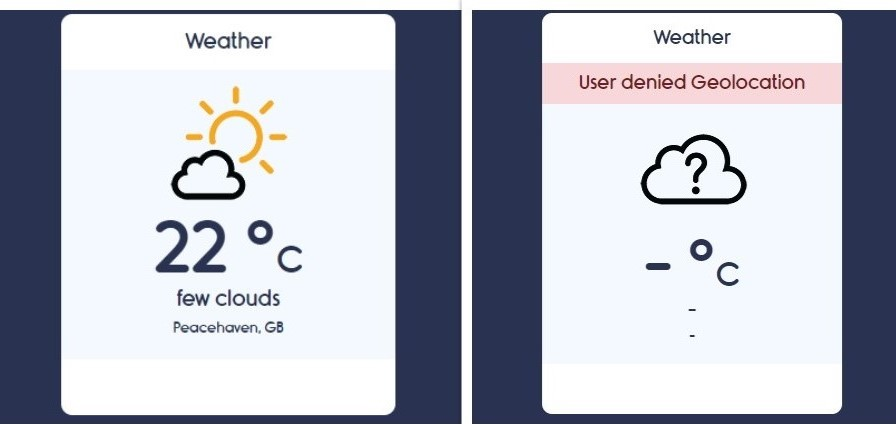

# Weather-App using Vanilla JavaScript, HTML and CSS.

This project is a simple weather forecast which uses some APIs to fecth data from the OpenWeatherMap using Geolocation. The main goal of this project is to be a sample of how to build a Weather App using APIs.

## Display

## Useful information:
- The API provider: [Open Weather Map Api](https://openweathermap.org)
- The icons used are created by the Graphic Designer [Ashley Jager](https://github.com/manifestinteractive/weather-underground-icons).

## Skills Requirements for this project:
- HTML and CSS knowledge.
- You will use: objects, functions, if statemens, among others.
- API knowledge.
